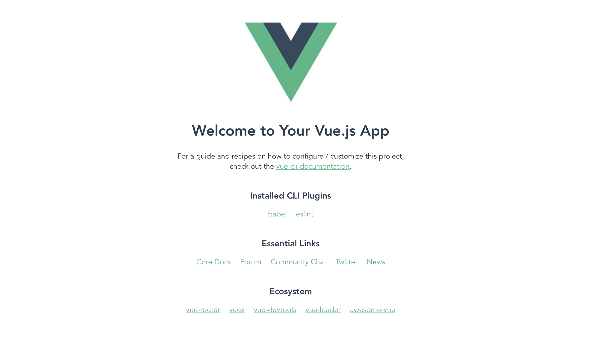

# vue-cli

## vue-cli 란?
CLI는 Console Line Interface의 약자로써 쉽게 말해 커맨드 라인에서 명령어를 입력해 컴퓨터와 I/F 하는것을 말한다.  가장 대표적인 예시로는 도스, 명령 프롬프트, bash로 대표되는 유닉스 셸 환경이 있다.  
vue-cli는 는 기본 vue 개발 환경을 설정해주는 도구이다.  
vue-cli 가 기본적인 프로젝트 세팅을 해주기 때문에 폴더 구조에 대한 고민, lint, build, 어떤 라이브러리로 구성을 해야되는지 webpack 설정은 어떻게 해야되는지에 대한 고민을 덜을 수 있다.

***

## vue-cli 설치
```bash
$ npm install -g @vue/cli
```
설치 후 아래 명령어를 입력하였을 때 vue 의 version 이 나온다면 정상설치 된 것
```bash
$ vue --version // 4.1.1
```

***

## vue-cli로 vue 프로젝트 생성
```bash
$ vue create {프로젝트명}

// ex) $ vue create hello-world
```
* Windows 에서 별도의 bash 프로그램을 사용 중이라면 프로젝트 옵션 선택이 안 될수 있기 때문에 Windows 기본 cmd를 사용할 것을 권장 함

이후 Babel, TypeScript, PWA, Router, Vuex, CSS Pre-processors, Linter / Formatter, Unit Testing, E2E Testing 등 필요한 라이브러리와 설정들을 추가할 수 있음

***

## vue 프로젝트 실행

프로젝트 생성후 해당 프로젝트 폴더로 이동하신 후 명령어를 이용하여 dev 서버를 실행한다.
```bash
 $ cd hello-world
 $ npm run serve
```
localhost:8080 접속 시 아래와 같이 뜨면 정상이다.

